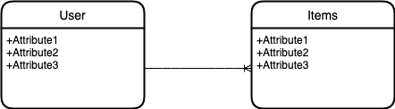

# Welcome to phase 4!

### Phase Objectives

- Create RESTful APIs
- Validate data
- Share data between a frontend JavaScript application and a backend API application
- Build authentication into APIs
- Deploy backend applications

### What is Rails?

- A web application framework: provides the foundational base for every application, removing configuration and setup repetition. Allowing developers to focus on the integral portions of building the application.
- Do more with less code.
- Written in Ruby programming language
- A gem: needs to be installed in order to have accessibility to Rails tools.
- Implements the MVC framework to help clarify code separation and organization
- 2 major principles to follow:
  - Convention over configuration: Rails is opinionated. This can help Free up a developers dedication to making decisions about folder structure, file and variable namings, routing.
  - DRY: Don't Repeat Yourself: Makes code more maintainable and less buggy

### Sinatra vs Rails

<p align="center">
    
</p>

# App Design:

### Marketplace

We will be building a Marketplace application. We will keep track of the items a user has sold, as well as items users have purchased.

### Domain Model

<p align="center">
    
</p>

### Create a Rails application named 'marketplace-api'

<div id='pt1'></div>

- Run the following command:

```rb
rails new marketplace-api --api --minimal --skip-javascript -T
```

Explanation of what --minimal excludes: https://www.bootrails.com/blog/rails-new-options/#skip-almost-all-features

- `cd` into `marketplace-api`

### Configure CORS<a name="pt2"></a>

<div id='pt2'></div>

- Navigate to `config/initializers/cors.rb` and comment out lines 8-16
- Change `origins` to `'*'`

```rb
Rails.application.config.middleware.insert_before 0, Rack::Cors do
  allow do
    origins '*'

    resource '*',
      headers: :any,
      methods: [:get, :post, :put, :patch, :delete, :options, :head]
  end
end
```

- In gemfile, comment back in `gem 'rack-cors'` and run `bundle update`

### Use Rails to generate models: User, Item, Category, CategoryItem

<div id='pt3'></div>

### Rails Generators: [Cheatsheet](https://shannoncrabill.com/blog/ruby-on-rails-singular-or-plural-generator-cheat-sheet/)

<details>
  <summary>rails g controller </summary>
    <ul> 
        <li> Creates controller in app/controllers</li>
        <li> Creates a route in config/routes if actions are provided as arguments <strong>NOTE:</strong> these routes are not useful, will not follow REST convention </li>
    </ul>
</details>

<details>
  <summary>rails g model</summary>
    <ul> 
        <li>Creates a model file in app/models</li>
        <li> Creates a migration file in db/migrate, will include columns and types if provided as argument</li>
    <ul>
</details>

<details>
  <summary>rails g migration</summary>
    <ul> 
        <li> Creates a migration file in db/migrate</li>
        <li> Will include columns and types if provided as argument</li>
    </ul>
</details>
  
<details>
  <summary>rails g resource</summary>
    <ul>
        <li> Creates a migration file in db/migrate</li>
        <li> Creates a model file in app/models</li>
        <li> Creates controller in app/controllers</li>
        <li> Creates a route in config/routes if actions are provided as arguments <strong>NOTE:</strong> these routes are not useful, will not follow REST convention</li>
    </ul>
</details>
    
### We will use the resource generator to create 
```rb
rails g resource user name
```

<div id='pt3'></div>

```rb
class CreateUsers < ActiveRecord::Migration[6.1]
  def change
    create_table :users do |t|
      t.string :name

      t.timestamps
    end
  end
end
```

### Create some seed data in the `db/seeds.rb`

<div id='pt6'></div>

```rb

# Creating users:
10.times do
  User.create(name: Faker::Name.name)
end
```

### Define an index action for each resource

<div id='pt7'></div>

Index action: retrieve all instances of resource. i.e. `Item.all`

1. Need to define an endpoint `'/items'` in `config/routes.rb`. This can be done in 2 ways

```rb
get '/users', to: 'users#index'
```

or

```rb
resources :users, only: [:index]
```

2. Inside controller, define a method `index` that will return all records serialized in JSON format:

```rb
class UsersController < ApplicationController

  def index
    users = User.all
    render json: users
  end

end
```

### Define an show action for each resource

<div id='pt8'></div>

1. Need to define an endpoint `'/users/:id'` in `config/routes.rb`. This can be done in 2 ways

```rb
get '/users/:id', to: 'users#show'
```

or

```rb
resources :users, only: [:index, :show]
```

```rb
class UsersController < ApplicationController

    def index
        users = User.all
        render json: users
    end

    def show
        user = User.find(params[:id])
        render json: user
    end
end
```
